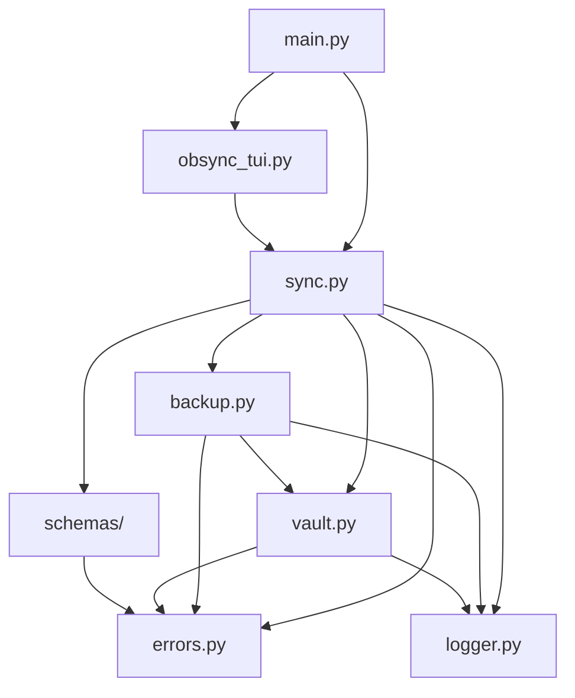

# ObsyncIt Core Package

This directory contains the core functionality of the ObsyncIt tool.

## Architecture Overview



## Module Dependencies

### Core Dependencies
- `sync.py` ← `backup.py`, `vault.py`, `schemas/`, `errors.py`, `logger.py`
- `backup.py` ← `vault.py`, `errors.py`, `logger.py`
- `vault.py` ← `errors.py`, `logger.py`

### Entry Points
- `main.py`: CLI entry point
- `obsync_tui.py`: TUI entry point

## Module Overview

### Core Modules

- `main.py`: Command-line interface entry point
  - Handles command-line arguments
  - Orchestrates the sync process
  - Provides error handling and logging setup

- `obsync_tui.py`: Terminal User Interface
  - Provides an interactive interface using Rich
  - Handles user input and validation
  - Displays sync progress and results

### Utility Modules

- `sync.py`: Sync Operations
  - Implements the `SyncManager` class
  - Handles file and directory synchronization
  - Provides sync preview functionality

Example usage:
```python
from obsyncit.sync import SyncManager

sync_mgr = SyncManager(
    source_vault="/path/to/source",
    target_vault="/path/to/target",
    config=config
)

# Sync specific items
sync_mgr.sync_settings(items=['themes', 'plugins'])

# Preview changes
sync_mgr.preview_sync()
```

- `backup.py`: Backup Management
  - Implements the `BackupManager` class
  - Handles backup creation and restoration
  - Manages backup rotation and cleanup

Example usage:
```python
from obsyncit.backup import BackupManager

backup_mgr = BackupManager(
    vault_path="/path/to/vault",
    backup_dir=".backups",
    max_backups=5
)

# Create backup
backup_path = backup_mgr.create_backup()

# Restore from backup
backup_mgr.restore_backup(backup_path)
```

- `vault.py`: Vault Operations
  - Manages Obsidian vault interactions
  - Validates vault structure
  - Handles vault-specific operations

Example usage:
```python
from obsyncit.vault import VaultManager

vault_mgr = VaultManager("/path/to/vault")

# Validate vault structure
if vault_mgr.is_valid():
    settings = vault_mgr.get_settings()
```

- `errors.py`: Error Handling
  - Defines custom exception classes
  - Provides error context and details
  - Improves error reporting

Example usage:
```python
from obsyncit.errors import VaultError, SyncError

try:
    sync_mgr.sync_settings()
except VaultError as e:
    print(f"Vault error: {e.message}")
    print(f"Details: {e.details}")
except SyncError as e:
    print(f"Sync error: {e.message}")
```

- `logger.py`: Logging Configuration
  - Sets up logging using Loguru
  - Configures log formats and outputs
  - Manages log rotation and retention

Example usage:
```python
from obsyncit.logger import setup_logging

setup_logging(
    level="DEBUG",
    log_dir="logs",
    rotation="1 week"
)
```

### Data Validation

- `schemas/`: JSON Schema Validation
  - Contains JSON schemas for settings files
  - Implements validation logic
  - Ensures data integrity

Example usage:
```python
from obsyncit.schemas import validate_settings

try:
    validate_settings(settings_file)
except ValidationError as e:
    print(f"Validation errors: {e.schema_errors}")
```

## Performance Considerations

### Memory Usage
- Use streaming for large file operations
- Implement lazy loading for settings files
- Clean up temporary files promptly

Example:
```python
# Good: Stream large files
with open(large_file, 'rb') as f:
    for chunk in iter(lambda: f.read(8192), b''):
        process_chunk(chunk)

# Bad: Load entire file
content = open(large_file, 'rb').read()
```

### File System Operations
- Batch file operations when possible
- Use appropriate buffer sizes
- Implement retry mechanisms

Example:
```python
# Good: Batch operations
with FileManager() as fm:
    for file in files:
        fm.queue_operation(file)
    fm.execute_batch()

# Bad: Individual operations
for file in files:
    process_file(file)
```

### Concurrency
- Use async operations for I/O
- Implement proper locking
- Handle race conditions

Example:
```python
async def sync_files():
    async with aiofiles.open(file_path, 'rb') as f:
        content = await f.read()
    await process_content(content)
```

## Development Guidelines

1. **Error Handling**
   - Use custom exceptions from `errors.py`
   - Provide meaningful error messages
   - Include context in error details

2. **Logging**
   - Use the logger from `logger.py`
   - Include appropriate log levels
   - Add context to log messages

3. **Code Style**
   - Follow PEP 8 guidelines
   - Use type hints
   - Document classes and functions

4. **Testing**
   - Write unit tests for new functionality
   - Update existing tests when modifying code
   - Ensure test coverage
